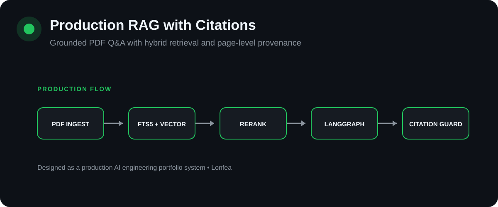

# Production RAG with Page Citations

[](https://github.com/Lonfea/production-rag-citations/actions/workflows/ci.yml)


<p align="center"></p>

A production-shaped PDF question-answering service that combines **lexical + vector retrieval**, **cross-encoder reranking**, strict **page-level citations**, and a grounding guard before responses reach the client.

## Product UI

A product-style interface is included at `app/static/index.html`. Run the FastAPI service and open `http://localhost:8000/` to use the interface against the real backend endpoints.

## Why this project exists

A basic RAG demo can retrieve chunks and call an LLM. A production RAG system also needs to answer:

- Where did the answer come from?
- Did retrieval use both exact terms and semantic similarity?
- Was the strongest evidence reranked?
- Can the answer cite only pages that were actually retrieved?
- What happens when grounding fails?
- Can the service be tested, containerized, and operated as an API?

This implementation addresses those concerns while remaining small enough to understand end to end.

## Architecture

```text
flowchart LR
PDF[PDF upload] --> EX[Page-aware extraction]
EX --> CH[Chunking]
CH --> FTS[(SQLite FTS5)]
CH --> VEC[(sqlite-vec)]
Q[Question] --> H[Hybrid retrieval]
FTS --> H
VEC --> H
H --> R[Cross-encoder reranker]
R --> G[LangGraph answer node]
G --> GG[Grounding + citation guard]
GG --> API[FastAPI response] 
```

## Request flow

```text
sequenceDiagram
participant U as User
participant API as FastAPI
participant RET as Hybrid Retriever
participant RR as Cross-Encoder
participant LLM as LangGraph / LLM
participant G as Grounding Guard
U->>API: Ask question
API->>RET: lexical + semantic retrieval
RET->>RR: fused candidates
RR->>LLM: top evidence with page metadata
LLM->>G: answer + [p.N] citations
G-->>API: validate cited pages
API-->>U: grounded answer + structured sources 
```

## What this demonstrates

This repository is designed to demonstrate more than a chatbot: **retrieval architecture, provenance preservation, second-stage ranking, explicit grounding constraints, API design, deterministic testing, local development and containerization.**

## Stack

- **LangGraph** — explicit retrieve → rerank → answer → grounding workflow
- **SQLite FTS5** — lexical retrieval
- **sqlite-vec** — local vector search
- **Sentence Transformers** — local embeddings
- **CrossEncoder** — second-stage reranking
- **FastAPI** — HTTP API
- **PyPDF** — page-aware PDF extraction
- **Docker + GitHub Actions** — reproducible build and CI

## Retrieval strategy

1. Index each PDF page into overlapping chunks while preserving the original page number.
2. Run FTS5 lexical search.
3. Run semantic KNN search with sqlite-vec.
4. Fuse both result sets using **Reciprocal Rank Fusion (RRF)**.
5. Rerank the fused candidates using `cross-encoder/ms-marco-MiniLM-L6-v2`.
6. Give only the top evidence to the model.

Cross-encoders are intentionally used after first-stage retrieval because they are usually more accurate but more computationally expensive than bi-encoder retrieval.

## Retrieval benchmark

`scripts/benchmark_financebench.py` measures page-level retrieval on [FinanceBench](https://github.com/patronus-ai/financebench): 150 questions over 84 public SEC filings, each labelled with the page that holds the evidence. All filings go into one shared index (11,948 pages, 43,623 chunks), so the retriever has to find the right company and year as well as the right page. A question counts as a hit at *k* if any of the top *k* chunks comes from an evidence page.

| Mode | Page hit@1 | Page hit@5 | Page hit@10 | Filing hit@5 | MRR@10 |
|---|---:|---:|---:|---:|---:|
| Lexical (FTS5 / BM25) | 0.07 | 0.11 | 0.15 | 0.49 | 0.10 |
| Semantic | not yet run | | | | |
| Hybrid (RRF) | not yet run | | | | |
| Hybrid + cross-encoder rerank | not yet run | | | | |

Only the lexical row has been measured. The environment used to write this could not download the embedding and reranking models from Hugging Face, so the remaining rows need a run on a machine with internet access:

```bash
python scripts/benchmark_financebench.py \
  --modes lexical,semantic,hybrid,hybrid+rerank \
  --output benchmarks/financebench.json
```

The first run downloads about 160 MB of filings. Text extraction and indexing took about 12 minutes here without embeddings; computing embeddings for 43,623 chunks adds more time on a CPU.

What the lexical baseline shows:

- **Keyword search alone is not enough for financial filings.** The evidence page is in the top 5 for 11% of questions, and the right filing for 49%. The 84 filings share most of their vocabulary, so terms like "revenue" or "operating income" match every document.
- **Metric questions fail on vocabulary mismatch** (2% page hit@5). A question about "capital expenditure" has to find a cash-flow line called "Purchases of property, plant and equipment". This is the gap the semantic arm and the reranker are meant to close, and the full run will show whether they do.
- **Removing stopwords did not help.** Filtering words like "what" and "the" from the query moved page hit@5 from 0.11 to 0.13 but lowered filing hit@5. That's within noise for 150 questions, so the query builder was left unchanged.

The benchmark also found a bug: some filings are AES-encrypted (readable without a password), and pypdf needs the `cryptography` package to open them. Uploading one used to return a 500 error. `pypdf[crypto]` is now a dependency, and unreadable PDFs return 422.

## Grounding contract

The model receives evidence in this form:

```text
[p.7 | annual-report.pdf]
<retrieved text>
```

It is instructed to cite factual claims with `[p.N]`. The final guard rejects:
- answers with no page citations;
- citations to pages not present in retrieved evidence.

The API then returns the answer plus structured source metadata.

## Run locally

```bash
git clone https://github.com/Lonfea/production-rag-citations.git
cd production-rag-citations
python -m venv .venv
source .venv/bin/activate
pip install -e .
cp .env.example .env
uvicorn app.main:app --reload
```

Default generation uses a local Ollama model:

```bash
ollama pull llama3.2:3b
```

Set `MODEL_PROVIDER=openai` and `OPENAI_API_KEY` to use an OpenAI model instead.

## API

### Ingest a PDF

```bash
curl -F "file=@report.pdf" http://localhost:8000/ingest
```

### Ask a question

```bash
curl -X POST http://localhost:8000/ask \
  -H "Content-Type: application/json" \
  -d '{"question":"What were the main risks discussed?"}'
```

Example response:

```json
{
  "answer": "The report highlights supply-chain and transition risks [p.12].",
  "sources": [
    {"source":"report.pdf","page":12,"score":0.88}
  ]
}
```

## Tests

```bash
pytest
ruff check .
```

28 tests cover the full ingest → search → answer → grounding path against a real SQLite FTS5 and sqlite-vec index. They use small deterministic stand-ins for the embedding model, reranker and LLM (`tests/fakes.py`), so they run in about a second with no downloads or API keys. They include failure cases: unreadable uploads, a model crash during re-ingestion (the previous version must survive), citations to pages that were never retrieved, and an unreachable model backend (503).

## Known limitations

- `sqlite-vec` is currently pre-v1 and can introduce breaking changes.
- Text extraction does not include OCR for scanned PDFs.
- The local cross-encoder adds latency on CPU; production deployments should batch or accelerate reranking.
- This version is single-tenant and intentionally leaves authentication to a later portfolio system.
- **Citations identify pages, not documents.** The grounding guard checks that `[p.N]` matches a retrieved page number. With several documents indexed, page 3 of one filing and page 3 of another are indistinguishable, so a citation can pass the guard while pointing at the wrong document.
- **Chunks split at fixed character counts**, sometimes mid-sentence or mid-table. Financial statements extract as flattened text, which makes table lookups harder for both retrievers.

## Next engineering upgrades

- tracing and request metrics with OpenTelemetry;
- run the full FinanceBench ablation and report semantic, hybrid and reranked retrieval;
- source-aware citations (`[doc p.N]`) so the guard can check the document as well as the page;
- prompt-injection and PII middleware;
- model router with per-request cost telemetry;
- streaming UI.
